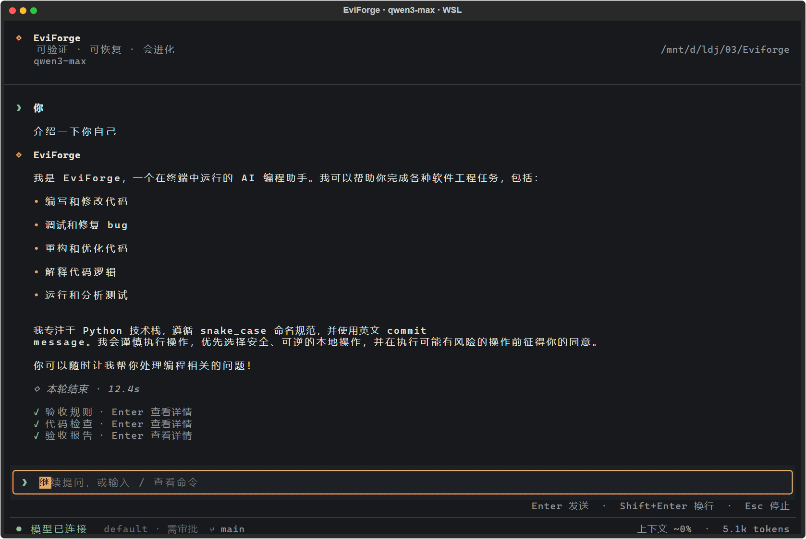
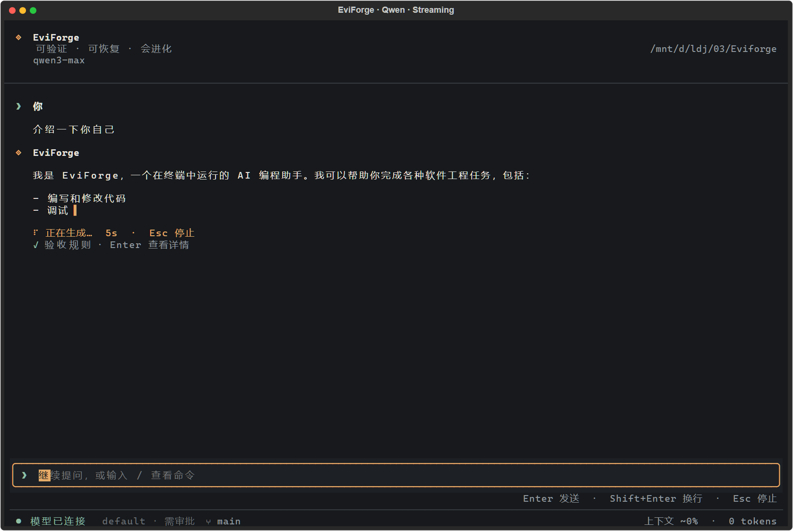

# EviForge TUI 改造与验证报告

日期：2026-10-09

## 代码基线

目录：`D:\ldj\03\Eviforge`（WSL 路径 `/mnt/d/ldj/03/Eviforge`）。开始修改前，工作区干净，本地 HEAD 与 GitHub main 同为 `369aedae00e7c7ba178a02e93ed2e225767b2d53`，项目版本为 0.3.0。本报告随 TUI 改造代码一并纳入版本控制。

## 界面变化

- 石墨灰背景、暖白正文、琥珀色强调，使用 `◈` 品牌标识和助手标记；顶部显示真实模型与工作目录。
- 对话区支持滚动，输入框和状态栏固定在底部。窄窗口自动隐藏次要信息，检查了 136×44、80×24、58×20 三种尺寸。
- 中文输入提示、Enter 发送、Shift+Enter 换行、Esc 停止；保留命令补全、输入历史、权限切换和工具交互。
- 流式回复显示光标与生成状态；完成后转为 Markdown。修复原逻辑在 TurnComplete 时先丢弃累积文本、导致回复未完成 Markdown 收尾的问题。
- 恢复的历史消息使用相同角色样式；取消或 Provider 失败保留已收到的文本，清理流式光标并恢复输入焦点。
- 状态栏显示真实连接状态、权限模式、Git 分支和 API 报告的累计 token。首次收到响应前显示“模型就绪”；上下文百分比为 ConversationManager 的当前对话估算，使用 `~` 标识，不是实时服务端上下文占用计量。
- Hook 默认显示简短摘要，点击或聚焦后按 Enter 展开原始记录；失败记录默认展开。各轮工具块保持独立容器。

## 测试

| 环境 | 最终结果 | 用时 |
| --- | --- | --- |
| WSL Ubuntu 24.04 / Python 3.12.3 / Textual 8.2.5 | **956 passed** | 63.27s |
| Windows / Python 3.12.7 / Textual 8.2.5 | **950 passed, 6 skipped** | 80.86s |

新增 8 项 UI 回归，覆盖响应式布局、中文换行、真实输入提交到 Agent 的路径、流式收尾、取消与断流、历史恢复及 Hook 详情。全量回归同时覆盖现有 Agent、工具、Plan 审批、Session、Memory、MCP、Skill、DAG、Hook 和 Worktree 测试。

早期 Windows 测试被旧系统临时目录权限阻断，改用项目内独立测试临时目录后完成上述最终运行。没有通过跳过失败用例来获得通过结果。

本地原始日志：`.eviforge/ui-qa/pytest-wsl-final.log`、`.eviforge/ui-qa/pytest-windows-final.log`。测试命令为相应 Python 环境运行 `python -m pytest -q`，并为各次运行指定独立 `--basetemp`。

## 真实模型验证

- 用户输入：`介绍一下你自己`
- 模型：`qwen3-max`，使用用户授权的既有 DashScope 凭据。
- 在 WSL 的真实 PTY 中运行修改后的 EviForgeApp 与 NoAltScreenDriver，由 Textual Pilot 向输入框填入问题并按 Enter；沿用项目真实 Agent、Provider 客户端和默认 Hook。
- 最终状态：`success`，观察到真实流式增量，累计 API token 为 5102，本次对话捕获用时 13.27s。这是单次功能验证，不是性能基准。
- API 密钥只在测试进程中从用户指定的本地文件读取，没有写入代码、报告或截图。

模型原始回复：

> 我是 EviForge，一个在终端中运行的 AI 编程助手。我可以帮助你完成各种软件工程任务，包括：
>
> - 编写和修改代码
> - 调试和修复 bug
> - 重构和优化代码
> - 解释代码逻辑
> - 运行和分析测试
>
> 我专注于 Python 技术栈，遵循 snake_case 命名规范，并使用英文 commit message。我会谨慎执行操作，优先选择安全、可逆的本地操作，并在执行可能有风险的操作前征得你的同意。
>
> 你可以随时让我帮你处理编程相关的问题！

## 运行截图

以下为实际 Textual compositor 画面导出后渲染的 PNG，未替换模型回复，未用图像生成模型重绘。外层标题栏是 Rich SVG 导出的默认装饰，不是 Windows 桌面窗口截屏。修正了 Rich SVG 导出器对中文 `textLength` 使用字符数而非终端单元格宽度的问题，并在 PNG 渲染时使用本机字体；对话内容、布局和实际状态保持原样。

### 回复完成

### 流式输出中

原始 SVG、PTY 日志及脱敏结果 JSON 保存在 `.eviforge/ui-qa/`（Git 忽略的本地验证目录）。

## 本次源码校验值

- `eviforge/app.py`: `55a542987c70bc4acb94f350533f3f8fc08ae115616b3d66f7bcd4c7bf8aa76e`
- `eviforge/styles.tcss`: `de118f88d5e7bd8a15efa44ffeeb0c4d5acfffb65285c1104257e908fca134bf`
- `tests/test_tui_presentation.py`: `5deaf052655f51a90a0244f6ae454d4a13e7426e3b694f60640fd0b1780e141d`
