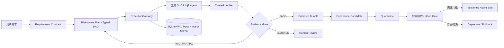

# EviForge 架构与面试讲解

EviForge 的核心不是增加 Agent 数量，而是把非确定性决策放在确定性的工程控制面中。



## 1. 请求与状态流

`TaskRun` 的合法主路径是：

`RECEIVED → CONTRACT_READY → PLANNING → EXECUTING → VERIFYING → COMPLETED → EVOLUTION_PENDING`

Evidence Gate 的映射只有一处：`PASS→COMPLETED`、`FAIL→REPLANNING`、
`PARTIAL→PARTIAL`、`BLOCKED→NEEDS_HUMAN`。L4 策略拒绝是终态
`POLICY_DENIED`，不存在“用户批准后绕过”。SQLite 保存权威当前状态与 append-only
Trace；JSONL 只是可重生投影，因此项目不滥用 Event Sourcing 术语。

## 2. 工具执行与审批

主 Agent 的 Tool/MCP/Skill/AgentTool 执行路径统一进入 `ExecutionGateway`；raw Hook 的
command/http 动作在 reviewed Plan 下 fail-closed，但尚未包装为 typed gateway tool：

1. 严格 Pydantic 参数校验，拒绝模型偷偷添加的审批字段；
2. `ToolDescriptor` 补齐 side effect、idempotency、path 与 risk metadata；
3. 风险引擎给出 L0–L4 和 stable reason codes；
4. L0 自动允许，L1 可逆写入会审计，L2 批量审批，L3 使用参数绑定的一次票据，
   L4 永久拒绝；
5. Trace 只保存参数名与 hash，不持久化原始凭证或源码正文。

审批票据绑定 `action_id + args_hash + cwd_realpath + plan_hash + pre_state_hash + TTL`。
票据先 CAS 到 `RESERVED`；`RESERVED→CONSUMED` 与 Action `STARTED` 在同一个
SQLite `BEGIN IMMEDIATE` 事务内完成，防止“票烧了但动作没开始”和并发复用。

## 3. 崩溃恢复的真实性边界

Action Journal 支持在 `PREPARED` 时记录 old/desired hash、target realpath、temp path 与
postcondition；CAS 文件替换 fixture 若在 `os.replace` 后、数据库写成功前崩溃，恢复
扫描可根据 desired hash 判定已提交并补记 `SUCCEEDED`。当前生产 Write/Edit 尚未改成
这一 CAS 协议，而是作为 opaque external action 记账。无法查询的 shell/MCP/外部 API
副作用也绝不声称 exactly-once：一律进入 `UNCERTAIN/NEEDS_HUMAN`，不得自动重放。

`attempt_id + fencing_generation` 防止过期 worker 写回控制面。它不能撤销已发送给
外部系统的请求，因此只有 fenced workspace、CAS 文件或服务端 idempotency key 才
允许自动重派。

## 4. Evidence-first 完成门禁

Verifier 只运行 Contract 预注册的 argv，并使用 `create_subprocess_exec`，不经 shell。
每个 Receipt 绑定 base commit、tracked binary diff、untracked 内容 manifest 与 cwd。
代码在验证后发生变化，Receipt 立即 stale。Agent 的自然语言“完成”不是证据；主循环
只有收到 Gate PASS 才发 `LoopComplete`。非 PASS 会收到结构化
`verification-feedback` 并继续，headless 模式会以失败状态退出而不是打印假成功。

## 5. Trace-to-Skill Evolution

会话经验不会直接写入活动 Skill。当前已实现候选抽取、注册表与以下门禁 API：

- Trace service 只接受已完成 Evidence Gate 的 task；
- Candidate 经 prompt injection、绕审批、凭证和隐私路径规则清洗后进入 quarantine；
- 同签名同内容标 duplicate，同签名异内容标 conflict；
- 一次独立验证最多晋升 canary；active 默认需要三个预注册、仓库独立的 validation
  group，harm 必须为 0；
- SQLite manifest 是唯一事实源，`SKILL.md` 是可重建投影；
- 检索按 task/failure signature、scope、expiry 和 token budget 注入；低质量版本可原子
  rollback 到此前 active 版本。

自动 replay validation runner 和从候选到验证任务的完整交互入口尚未闭环；当前
`/evolution` 只提供状态、显式晋升、回滚和证据反馈。因此本节描述的是已实现的控制面
约束，不代表已经跑出自进化收益。

## 6. 多 Agent 的取舍

Typed DAG 只在任务可分解且收益覆盖编排成本时启用。Explorer 与 Verifier 只读；
Implementer 的 ChangeEnvelope 必须落在 predicted write-set 内；Verifier 使用 fresh
isolated context，避免实现者自证。调度器只并行依赖就绪且写集不冲突的节点，按
critical path 优先，同时限制 token、wall time 与并发。简单单文件任务仍由单 Agent
完成，避免“为了多 Agent 而多 Agent”。

实验性执行入口是 headless CLI `eviforge --dag graph.json`，不是 TUI `/dag` 命令，也不会
由模型自动生成或审批 TaskGraph。输入图必须预先审核。DAG 节点的 blocking criterion
必须声明 `verifier="deterministic"` 与 argv；宿主用无 shell 子进程执行，失败/超时会
让节点失败，receipt 只输出 argv hash、cwd、退出码、stdout/stderr hash 与字节数。

依赖工件不是提示词中的虚构 URI：节点输出先写入控制面下的 SHA-256 CAS，下游读取时
重新校验 digest/size，单工件默认最多注入 32 KiB、全部依赖最多 96 KiB，并标记为不可信
数据。Implementer/Integrator 则对声明 write-set 做前后 SHA-256 快照，默认生成可机读
change manifest，将其 CAS URI 放入 lease-bound `ChangeEnvelope.patch_ref`。这是路径与
内容 hash 清单，不是可直接 `git apply` 的 unified diff；全文件正文不会写进 DAG 报告。
每个生产节点另建持久化 TaskRun，成功闭合为 `COMPLETED`，失败闭合为 `FAILED`，调度
取消/超时闭合为 `CANCELLED`；最终状态与 acceptance receipts 一并进入 JSON 报告。

最小 blocking criterion 片段：

```json
{
  "criterion_id": "unit-tests",
  "description": "targeted unit tests pass",
  "verifier": "deterministic",
  "verifier_argv": ["uv", "run", "--frozen", "--no-sync", "python", "-m", "pytest", "-q", "tests/unit"],
  "verifier_cwd": ".",
  "timeout_seconds": 300,
  "blocking": true
}
```

## 7. 可观测与隐私

默认 `protection_mode=policy_only`：控制面放在 `%LOCALAPPDATA%/EviForge` 并拒绝
仓库保留路径，但同一 OS 用户下的恶意 shell 仍可主动打开该数据库。只有不同 OS
principal/ACL 或不挂载控制面的容器/AppContainer 才可标 `os_isolated`。Trace 默认
metadata-only；DAG CAS 保留节点文本输出与 change manifest，但不复制进 Trace/CLI
JSON。CAS 与运行数据库仍属于同一 OS 用户可读的本地控制面，并非秘密保险库。

## 8. 面试追问速答

- 为什么不是纯 Workflow？确定性步骤（权限、状态、验证、恢复）是 Workflow；代码探索
  与局部实现使用 Agent，两者边界显式。
- 为什么单测通过还不算完成？Requirement Criterion 可能还包含编译、静态检查、行为
  与用户可见结果；Gate 检查的是覆盖率和当前 diff，不是某条命令的退出码。
- Memory、RAG、Skill 如何区分？Memory 是事实/偏好，RAG 是检索机制，Task state 是执行
  真源，Skill 是经验证的可复用过程知识。
- 为什么不承诺 exactly-once？任意外部系统无法靠本地日志证明提交点；只对 CAS/可
  reconcile fixture 保证，未知副作用转人工。
- 指标如何可信？同一 runtime feature flag 对照、冻结数据 hash、ITT、cluster-aware CI，
  原始 runs.jsonl 可重算；合成集只说明机制，不外推通用 Coding 能力。
